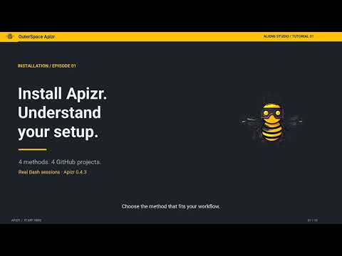

# Install Apizr

Install **Apizr 0.4.4**, then follow the [Quickstart](quickstart.md) to make your
first REST or MCP calls. The core is enough for that example; plugins are optional.

## Install the core

Use Python 3.11–3.14 on macOS or Linux, with a POSIX shell and pip.
Choose **one** installation method. For a first try, create a virtual environment:

```sh
mkdir apizr-workspace
cd apizr-workspace
python3 -m venv core
. core/bin/activate
python -m pip install outerspace-apizr==0.4.4
apizr --version
```

You should see `outerspace-apizr 0.4.4`. Keep this terminal open and continue with
[the Quickstart](quickstart.md). For an existing project, you can also
[initialize its configuration](onboarding.md).

<details markdown="1">
<summary>Already using uv or pipx?</summary>

Install Apizr as an isolated command-line tool with **one** of:

```sh
uv tool install outerspace-apizr==0.4.4
```

```sh
pipx install outerspace-apizr==0.4.4
```

Use the executable path reported by your tool. The Quickstart's pip path is
easier to follow for a first try because it keeps an explicit `core/` directory.

</details>

<details open markdown="1">
<summary>Watch: Install Apizr with pip, uv, pipx or Homebrew · 6:39</summary>

Compare the installation methods and check which Apizr executable you are using. The Homebrew segment shows a reinstall; for a fresh setup, use the install command below.

<div class="apizr-demo-video">
  <a class="apizr-demo-video__cover" href="https://www.youtube.com/watch?v=7J6TWqAdx4Q" data-apizr-video="7J6TWqAdx4Q" data-apizr-title="Install Apizr with pip, uv, pipx or Homebrew" aria-label="Play: Install Apizr with pip, uv, pipx or Homebrew">
    
    <span class="apizr-demo-video__play"><span aria-hidden="true">▶</span> Watch the tutorial</span>
  </a>
</div>

English · [Open on YouTube](https://www.youtube.com/watch?v=7J6TWqAdx4Q) ·
[Alien6 Studio](https://www.youtube.com/@Alien6Studio).
Use the written steps for the current release; a recording may show an earlier version.

</details>

## Homebrew on Apple Silicon

Use the [official Alien6 tap](https://github.com/Alien6-Studio/homebrew-tap):

```sh
brew tap alien6-studio/tap
brew install alien6-studio/tap/apizr
apizr --version
```

You should see `outerspace-apizr 0.4.4`. The Formula uses Homebrew Python 3.14.
Its installation is tested on hosted Apple Silicon; Intel macOS and Linux
Homebrew runtime are not qualified. See the
[release record](../releases/0.4.4.md#validation) for details.

## Add optional plugin profiles

| You want to… | Install |
| --- | --- |
| Inspect Python and generate REST/MCP interfaces | Core only |
| Let an MCP client analyze a project with Apizr | `mcp` profile |
| Build and publish a service image | `oci` profile |
| Deliver an image with an Attest receipt | `delivery` profile |

Plugins live in their own environments. Keep all selected core/plugin versions
at **0.4.4**. Install **uv 0.12.0** separately and check `uv --version` before
installing or syncing plugins. This also applies to Homebrew installations.

<span id="install-the-published-release"></span>
<span id="evaluate-the-040-candidate"></span>

### Obtain the installation files

The **durable GitHub release assets** include the packages, plugin catalog,
locks and dependencies for each [supported target](#supported-targets).
[Prepare a verified installation workspace](../contributing/verification.md#prepare-a-verified-installation-workspace)
once, then return here to choose a profile. That advanced procedure covers
hash checks and `gh attestation verify`; normal core installation above does
not need those files.

## Choose a plugin profile

The **core** is enough for supported static analysis and generation. Generated
REST/MCP servers have separate runtime requirements. The **`outerspace-apizr-mcp` plugin**
is an analysis server; the historical **`mcp` extra** supplies optional dependencies
for existing core workflows and does not install that plugin.

| Profile | Plugins | Additional prerequisites when used |
| --- | --- | --- |
| `mcp` | outerspace-apizr-mcp | An MCP client (the Python example needs no AI account) |
| `oci` | outerspace-apizr-oci | Docker Engine and Buildx for build/push |
| `delivery` | outerspace-apizr-oci and outerspace-apizr-attest | Docker/Buildx; Continuum Attest for receipts; ORAS for proof transport |

First [prepare the installation files](#obtain-the-installation-files). Keep
that workspace and terminal open: the commands below use its `TARGET`, `CORE_DIR`
and `APIZR_VERSION` variables. Set `CORE_DIR` to your existing core environment
if you installed it elsewhere. Choose **one** profile and new plan/plugin-store
directories. Use `oci` or `delivery` instead of `mcp` when needed:

```sh
export PROFILE=mcp
export PLAN="$PWD/$PROFILE-plan"
export PLUGINS_DIR="$PWD/plugins"
```

<!-- install:profile -->
```sh
"$CORE_DIR/bin/apizr" plugins catalog resolve --profile "$PROFILE" --catalog "$TARGET/catalog/catalogue.json" --wheelhouse "$TARGET/wheelhouse" --output-dir "$PLAN" --json
"$CORE_DIR/bin/apizr" plugins lock check --project "$PLAN/apizr.toml" --lock "$PLAN/apizr.plugins.lock.json" --wheelhouse "$TARGET/wheelhouse" --json
"$CORE_DIR/bin/apizr" plugins sync --project "$PLAN/apizr.toml" --lock "$PLAN/apizr.plugins.lock.json" --wheelhouse "$TARGET/wheelhouse" --plugins-dir "$PLUGINS_DIR" --json
"$CORE_DIR/bin/apizr" plugins list --active --json --plugins-dir "$PLUGINS_DIR"
```

**Observe:** resolution and lock checking succeed; sync records installations.
On this fresh store, the active inventory is empty. Activate only what you selected:

```sh
# mcp profile
"$CORE_DIR/bin/apizr" plugins enable outerspace-apizr-mcp --version "${APIZR_VERSION:-0.4.4}" --plugins-dir "$PLUGINS_DIR"
# oci profile: enable outerspace-apizr-oci instead
# delivery profile: enable both outerspace-apizr-oci and outerspace-apizr-attest
```

**Installation** verifies and stores bytes. **Activation** selects an installed
version. **Authorization** permits a particular operation and target; neither
installation nor activation grants it. The [analysis MCP guide](../reference/apizr-mcp-server.md)
provides a complete project, operator grant and client configuration. The
[OCI](../reference/oci-service-plugin.md) and [Attest](../reference/attest-delivery-plugin.md)
guides explain explicit image publication and signing permissions. These are
trusted programs running with user rights, not a universal sandbox.

<details markdown="1">
<summary>Offline core installation with pip, uv or pipx</summary>

<span id="install-the-candidate-with-pip"></span>

## Install the core offline

Use this alternative only when you need an offline installation. First
[prepare the installation workspace](../contributing/verification.md#prepare-a-verified-installation-workspace).
Its `PYTHON`, `CORE_DIR`, `TARGET` and `CANDIDATE` variables are used below.
The interpreter must match the target export's Python minor version.

<!-- install:pip -->
```sh
"$PYTHON" -m venv "$CORE_DIR"
"$CORE_DIR/bin/python" -m pip install --no-index --find-links "$TARGET/base" "$CANDIDATE/dist/outerspace_apizr-${APIZR_VERSION:-0.4.4}-py3-none-any.whl"
"$CORE_DIR/bin/apizr" --version
```

Observe `outerspace-apizr 0.4.4`, then activate it with `. "$CORE_DIR/bin/activate"`
and follow the [Quickstart](quickstart.md).

### Alternatively, install as a tool

With uv already installed, use this **instead of** pip:

<!-- install:uv -->
```sh
uv tool install --python "$PYTHON" --offline --no-index --find-links "$TARGET/base" "$CANDIDATE/dist/outerspace_apizr-${APIZR_VERSION:-0.4.4}-py3-none-any.whl"
```

Or, with pipx already installed, use:

<!-- install:pipx -->
```sh
pipx install --python "$PYTHON" --pip-args="--no-index --find-links=$TARGET/base" "$CANDIDATE/dist/outerspace_apizr-${APIZR_VERSION:-0.4.4}-py3-none-any.whl"
```

Use the executable path reported by that tool, then check `apizr --version`.
Do not install plugins with `pipx inject` or manually edit a uv tool environment.
The profile example below uses the principal pip path (`$CORE_DIR/bin/apizr`);
for tool installations use that reported Apizr executable instead.

</details>

## Supported targets

The published 0.4.4 release includes the following dependency exports for offline
and plugin installation. Each records the exact Python patch version it supports.
Choose the matching interpreter and export; the table is not a Windows or Intel
macOS compatibility claim.

| System / architecture | Python | Release export pattern |
| --- | --- | --- |
| Linux x86-64 | 3.11 | `apizr-0.4.4-linux-x86_64-cpython-3.11.*.tar.gz` |
| Linux x86-64 | 3.12 | `apizr-0.4.4-linux-x86_64-cpython-3.12.*.tar.gz` |
| Linux x86-64 | 3.13 | `apizr-0.4.4-linux-x86_64-cpython-3.13.*.tar.gz` |
| Linux x86-64 | 3.14 | `apizr-0.4.4-linux-x86_64-cpython-3.14.*.tar.gz` |
| macOS arm64 | 3.11 | `apizr-0.4.4-macos-arm64-cpython-3.11.*.tar.gz` |
| macOS arm64 | 3.14 | `apizr-0.4.4-macos-arm64-cpython-3.14.*.tar.gz` |

## Develop from source

Contributors should follow [development and checks](developer-guide/setup.md).
[Manual wheel preparation](../development/0.4.md#install-a-development-wheel)
and the guides' advanced sections remain available for custom evaluation builds.
Those builds have their own identities and cannot replace approved release bytes.
Review [plugin locks](../reference/project-plugin-locks.md) and
[operator permissions](../reference/operator-policy.md) before replacing
development locks, grants or activations.

For publication status and changes in this version, see the
[0.4.4 release notes](../releases/0.4.4.md).
