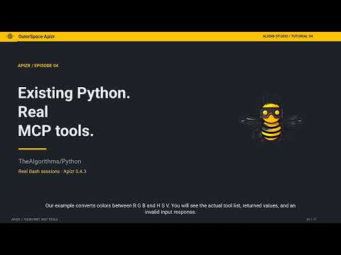

# Generate MCP from a Python file or notebook {#generate-an-mcp-server}

For a multi-module repository, use [REST/MCP from a repository](exposure.md)
or the [repository Quickstart](../quickstart.md). This guide takes one Python file
or notebook as its input.

[Install Apizr](../install.md), then generate an MCP server from your selected
Python functions. You can call it from an MCP client or an AI assistant.
Generation reads your source without running it; the server runs your functions
when a client calls them.

<details open markdown="1">
<summary>Watch: Generate MCP tools and call them with Python · 5:09</summary>

Expose color conversions from TheAlgorithms/Python, discover the tools and handle their results with the official MCP Python client.

<div class="apizr-demo-video">
  <a class="apizr-demo-video__cover" href="https://www.youtube.com/watch?v=rJThRd9vq4g" data-apizr-video="rJThRd9vq4g" data-apizr-title="Generate MCP tools and call them with Python" aria-label="Play: Generate MCP tools and call them with Python">
    
    <span class="apizr-demo-video__play"><span aria-hidden="true">▶</span> Watch the tutorial</span>
  </a>
</div>

English · [Open on YouTube](https://www.youtube.com/watch?v=rJThRd9vq4g) ·
[Alien6 Studio](https://www.youtube.com/@Alien6Studio).
Use the written steps for the current release; a recording may show an earlier version.

</details>

## Inspect and generate

The [TypedDict model example](inspect.md#structured-model-inputs-with-typeddict)
works with MCP as well as REST. `predict` advertises the same closed, nested object
in `inputSchema`. Calling it with
`{"payload":{"customer_id":"c","features":{"age":2,"score":3}}}` returns
`isError=false`, structured content `{"result":6.0}` and matching JSON text.
Missing, extra or invalid nested fields produce `isError=true`, no structured
content and the text `Invalid tool arguments`. Return annotations remain
descriptive; generated tools do not advertise `outputSchema`.

Given `pricing.py`:

```python
from typing import Literal


def calculate(prices: list[float], /, *, currency: Literal["EUR", "USD"] = "EUR"):
    """Add the supplied prices and retain their currency."""
    return {"total": sum(prices), "currency": currency}
```

Inspect its eligibility, then generate into a new directory:

```bash
apizr inspect pricing.py
apizr generate mcp pricing.py --output-dir ./generated-mcp
```

One `.ipynb` input works too. Dotted logical identities and selection are explicit:

```bash
apizr generate mcp pricing.py --module-name project.pricing \
  --select calculate --output-dir ./generated-mcp
```

Selection accepts comma-separated names or full capability IDs. Unknown names and
non-eligible selections fail. Without selection, any conditional, unsupported or
ambiguous callable declaration prevents generation. There is no unsafe override.
Use an empty physical directory without symlink components; existing user files
are never overwritten.

## Run trusted source

Starting a direct-mode server **imports and executes the bundled source**; a governed server defers that import to its worker on each call. Run
only source and dependencies you trust. Readiness is not a security sandbox or an
execution approval.

```bash
cd generated-mcp
python3 -m venv .venv
.venv/bin/python -m pip install -r requirements.txt
.venv/bin/python server.py --transport stdio
```

For a local HTTP endpoint instead:

```bash
.venv/bin/python server.py --transport streamable-http --port 8000
```

Connect to `http://127.0.0.1:8000/mcp`. Both transports use the official Python MCP
SDK v2 and target protocol `2026-07-28`. The same generated files serve both. The
server binds locally by default; exposing it remotely requires your deployment's
access-control policy.

The runtime environment needs no Apizr installation. `requirements.txt` declares
`mcp>=2.2,<3`, AnyIO and Uvicorn. Source dependencies are not inferred or bundled.

## Call a Tool with the official SDK

With the HTTP server running, use the official SDK client in another process:

```python
import asyncio

from mcp import Client


async def main():
    async with Client("http://127.0.0.1:8000/mcp") as client:
        print((await client.list_tools()).tools)
        result = await client.call_tool("calculate", {"prices": [10, 20]})
        if result.is_error:
            raise RuntimeError(result.content)
        print(result.structured_content)  # {"total": 30.0, "currency": "EUR"}


asyncio.run(main())
```

The omitted currency uses Python's default. Explicit null is accepted only for
nullable or unconstrained inputs. Extra fields and invalid types return a Tool
error. Positional-only inputs remain object fields in MCP; the adapter reconstructs
the Python call. Supplying a later optional positional-only field requires its
preceding positional-only fields, exactly as in REST.

Object results stay unchanged. Other finite JSON results use an object envelope:
`25.0` becomes `{"result": 25.0}`, a list becomes `{"result": [...]}`, and `None`
becomes `{"result": null}`. Read the value from `result.structured_content["result"]`
for these functions. Python result tuples, including nested tuples, are recursively
converted to JSON arrays in order: `(1, 2)` becomes `{"result": [1, 2]}`, and
`{"support": ("61.8%", 10.674)}` becomes `{"support": ["61.8%", 10.674]}`.
This applies to direct, local-process and OCI modes, including repository bundles.
The text content serializes the same object. This correction
requires regenerating older bundles that emit bare values, which strict clients
can reject. See the [result contract](../../architecture/mcp-generator-v1.md#results-and-public-errors).

Sync and async functions work. After tuple normalization, results must contain
only finite JSON scalars, arrays and dictionaries with string keys. NaN, infinity,
arbitrary objects and sets remain rejected even when nested. Tuples are normalized
at the result boundary; JSON inputs and Python argument reconstruction keep their
existing rules. An unannotated return remains unknown during static analysis;
declared return annotations do not constrain runtime results. Unsupported results and
unexpected exceptions produce `Tool execution failed` without internal exception
details. The server does not assign safety annotations because effects are unknown.

## Choose direct or governed execution

Direct mode remains the default. To opt into a bounded fresh worker for every
request/Tool call, generate a separate bundle with an explicit policy:

```sh
apizr generate mcp pricing.py --execution-policy examples/policies/local-default.json \
  --output-dir .output/mcp-governed
```

Use that example policy from the Apizr checkout, or create `policy.json` containing
`{}` and pass its path. Both Python and notebook inputs support the option.

| Behavior | Direct (default) | Governed (opt-in) |
| --- | --- | --- |
| Source import | In server at startup | Only in a fresh worker on each call |
| Globals / mutable defaults | Persist between calls | Reset each call |
| Wall timeout | No process timeout boundary | Worker termination on policy deadline |
| Worker protocol | Existing in-process invocation | Bounded input/output |
| Environment | Server environment | Clean or explicitly allowlisted |
| Filesystem/network sandbox | None | None |

**Both modes require trusted code. Governed mode is not a filesystem/network
sandbox.** It requires a supported POSIX runtime host. Unsupported requested
controls, such as network denial, are refused during generation; unavailable
runtime facilities or invalid artifacts fail startup. No Apizr installation is
needed to run either bundle. Install its own `requirements.txt` and use the same
startup commands below.

Governed startup checks policy, plan, source and artifact digests without importing
source. Changed source/plans/policy or missing worker files after startup cause
sanitized call errors; the server remains usable. Generation stays static in both
modes. OpenAPI/Tool definitions stay identical. The CLI reports `execution.mode`;
only governed bundles add an `execution/` bridge and `apizr_governed/` runtime.

Governed Tool errors are `Invalid tool arguments`, `Tool execution timed out`, or
`Tool execution failed`. No worker status, stderr, traceback or private path reaches
the client. Both stdio and Streamable HTTP support governed execution, using the
same SDK v2 / MCP 2026-07-28 contract and finite JSON result rules as direct MCP.

See [governed transport architecture](../../architecture/governed-transport-runtime-v1.md)
and the [execution policy guide](execute.md) for defaults, limits, environment
allowlists and the precise trust boundary.

## Inspect the generated files

`mcp-tools.json` records the Tool names, input schemas, descriptions and original
capability IDs without starting a server. Simple ASCII function names are preserved;
long, Unicode or reserved names receive a deterministic name documented in the
[architecture reference](../../architecture/mcp-generator-v1.md#tool-identity-and-descriptions).

`apizr-mcp.json` records `apizr.mcp/v1`, protocol assumptions, source/IR/readiness
digests and artifact hashes. Source integrity is checked before runtime import,
and callable shape is checked afterwards. A modified source fails startup; rerun
generation from the intended source instead of editing its expected digest.

Only Tools are generated. Resources, Prompts, Tasks, Apps, Skills, agents,
repository scanning, containers, sandboxing and attestation are outside this path.
Historical generation and `apizr generate rest` remain available separately.

See the [MCP architecture contract](../../architecture/mcp-generator-v1.md) and
[REST guide](rest.md) for the shared validation semantics.

## Governed OCI-container mode

There are three explicit modes: direct (default), governed local-process (v1
policy), and governed OCI-container (v2 policy). Local-process bundles and their
bytes remain unchanged and do not require Docker.

Prepare a trusted local worker image as described in the
[execution guide](execute.md#advanced-explicit-oci-container-execution), then use
its full immutable ID and platform:

```sh
apizr generate mcp sample.py --output-dir ./generated-oci \
  --execution-policy examples/policies/container-default.json \
  --runtime-image sha256:<full-64-character-local-image-ID> \
  --runtime-platform linux/amd64
```

Generation works without Docker and never pulls images. Both image and platform
are mandatory for OCI; image options with a local v1 policy are errors. Install
`generated-oci/requirements.txt` in the server environment; Apizr itself is not
required there. Docker CLI/Engine and the selected prepared worker image must be
available when starting the generated server. Startup checks fail before serving
if the provider or image is unavailable.

The interface definition is identical across modes; execution changes. Every OCI
call uses a fresh container, so globals and mutable defaults reset. The transport
never imports user source. The capability receives the existing OCI filesystem,
network and resource limits. Subprocesses remain permitted but contained.
See the [v2 bridge contract](../../architecture/governed-oci-transports-v2.md) for
the control matrix, sanitized error mappings, integrity checks and trust boundary.
