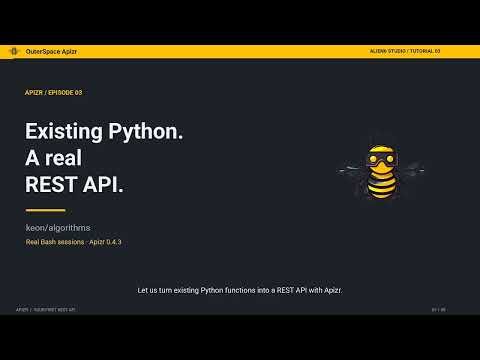

# Generate REST from a Python file or notebook {#generate-a-rest-interface}

For a multi-module repository, use [REST/MCP from a repository](exposure.md)
or the [repository Quickstart](../quickstart.md). This guide takes one Python file
or notebook as its input.

[Install Apizr](../install.md), then use `apizr generate rest` to turn a Python
file into a FastAPI application. It includes an OpenAPI description and a copy of
your selected source. Generation does not run the source.

<details markdown="1">
<summary>Watch: Generate a REST API and make HTTP calls · 4:14</summary>

Expose gcd and lcm from keon/algorithms, start the server and try successful requests and an invalid input.

<div class="apizr-demo-video">
  <a class="apizr-demo-video__cover" href="https://www.youtube.com/watch?v=QdtaLoc-g6o" data-apizr-video="QdtaLoc-g6o" data-apizr-title="Generate a REST API and make HTTP calls" aria-label="Play: Generate a REST API and make HTTP calls">
    
    <span class="apizr-demo-video__play"><span aria-hidden="true">▶</span> Watch the tutorial</span>
  </a>
</div>

English · [Open on YouTube](https://www.youtube.com/watch?v=QdtaLoc-g6o) ·
[Alien6 Studio](https://www.youtube.com/@Alien6Studio).
Use the written steps for the current release; a recording may show an earlier version.

</details>

Start with `pricing.py`:

```python
def total(prices: list[float], *, tax: float = 0.2) -> float:
    return sum(prices) * (1 + tax)
```

Inspect and generate:

```sh
apizr inspect pricing.py --module-name project.pricing
apizr generate rest pricing.py --module-name project.pricing --output-dir .output/rest
```

The directory must be new or empty. Existing files and symlink paths are refused;
there is no destructive `--force` option. Use a physical directory path if a
filesystem alias such as `/tmp` is a symlink on your system. Safe output writing
requires the directory-descriptor/no-follow facilities tested on Linux and macOS;
unsupported hosts fail before writing.

## Start the application

**Direct-mode startup imports and executes the bundled source; governed mode imports it only inside the worker on a call. Run only trusted code.** A
`ready` result concerns the static interface contract, not runtime safety.

Create a separate environment for the generated server:

```sh
python3 -m venv .output/runtime
.output/runtime/bin/python -m pip install -r .output/rest/requirements.txt
.output/runtime/bin/uvicorn app:app --app-dir .output/rest --host 127.0.0.1 --port 8001
```

Keep that terminal running. From a second terminal, check the server and call
`total`:

```sh
curl -f http://127.0.0.1:8001/health
curl -f http://127.0.0.1:8001/capabilities/total \
  -H 'Content-Type: application/json' \
  -d '{"prices": [10, 20]}'
# 36.0
```

Open `/docs` for interactive API documentation or `/openapi.json` for the same
OpenAPI document generated on disk. Functions always use POST under
`/capabilities/`; infrastructure routes stay separate.

## Select functions and inspect refusals

```sh
apizr generate rest pricing.py --select total --output-dir .output/selected
apizr generate rest examples/pricing.ipynb --module-name project.pricing --output-dir .output/notebook-rest
```

`--select` accepts comma-separated names or full IDs such as
`python:project.pricing:total`. Without selection, every callable assessment must
be eligible. Conditional, unsupported or ambiguous declarations stop generation
with their readiness reason codes. Selecting a ready function can exclude an
unrelated unsupported generator, but cannot override uncertainty recorded on the
selected function itself.

Only `can_generate_interface=true` passes. There is no unsafe override. Use
[`apizr inspect`](inspect.md) to understand decorators, rebinding, initialization,
dependencies and unresolved input types before changing the source.

Logical identity defaults to the input filename stem. A dotted `--module-name`
keeps identity explicit and portable; the bundle contains the corresponding
package structure. Avoid names already used by the runtime, including `app`
(the generated bootstrap), `json` or `fastapi`; conflicts fail startup clearly.

## Choose direct or governed execution

Direct mode remains the default. To opt into a bounded fresh worker for every
request/Tool call, generate a separate bundle with an explicit policy:

```sh
apizr generate rest pricing.py --execution-policy examples/policies/local-default.json \
  --output-dir .output/rest-governed
```

Use that example policy from the Apizr checkout, or create `policy.json` containing
`{}` and pass its path. Both Python and notebook inputs support the option.

| Behavior | Direct (default) | Governed (opt-in) |
| --- | --- | --- |
| Source import | In server at startup | Only in a fresh worker on each call |
| Globals / mutable defaults | Persist between calls | Reset each call |
| Wall timeout | No process timeout boundary | Worker termination on policy deadline |
| Worker protocol | Existing in-process invocation | Bounded input/output |
| Environment | Server environment | Clean or explicitly allowlisted |
| Filesystem/network sandbox | None | None |

**Both modes require trusted code. Governed mode is not a filesystem/network
sandbox.** It requires a supported POSIX runtime host. Unsupported requested
controls, such as network denial, are refused during generation; unavailable
runtime facilities or invalid artifacts fail startup. No Apizr installation is
needed to run either bundle. Install its own `requirements.txt` and use the same
startup commands below.

Governed startup checks policy, plan, source and artifact digests without importing
source. Changed source/plans/policy or missing worker files after startup cause
sanitized call errors; the server remains usable. Generation stays static in both
modes. OpenAPI/Tool definitions stay identical. The CLI reports `execution.mode`;
only governed bundles add an `execution/` bridge and `apizr_governed/` runtime.

Governed errors map invalid arguments to HTTP 422, timeout to 504, and every other
execution failure to generic 500. Results must already be finite JSON: unlike the
direct FastAPI encoder, governed execution rejects tuples, sets, bytes and arbitrary
objects. Return annotations still do not enforce results. Source exceptions,
including intentional HTTPException responses, are sanitized at the worker boundary.

See [governed transport architecture](../../architecture/governed-transport-runtime-v1.md)
and the [execution policy guide](execute.md) for defaults, limits, environment
allowlists and the precise trust boundary.

## Requests, defaults and errors

Every request body is an object; send `{}` to functions without parameters.
Unexpected fields, missing required fields and invalid types produce HTTP 422.
Strings and booleans are not silently accepted as numbers.

Omitting a defaulted field lets Python apply its own default. Explicit null is
validated: `x: int = None` permits omission but not `{"x": null}`; a nullable type
such as `int | None` permits both. Default expressions are never evaluated during
generation or copied into the request model.

Positional-only and keyword-only declarations keep their call semantics. For
`f(a=1, b=2, /)`, supply `a` when supplying `b`; a gap in positional arguments is
rejected with HTTP 422 and documented by OpenAPI. Trailing defaults may be omitted.

Declared return types are documentation only. Unexpected function/serialization
errors in direct mode produce a generic HTTP 500; intentional FastAPI `HTTPException` responses
are preserved. In direct mode, source digest or callable-shape mismatches stop application startup. Governed mappings are described above.

CLI exit codes:

- `0`: bundle written successfully;
- `1`: selected declarations are ineligible, or an approved contract cannot be lowered;
- `2`: input or output error, including unknown selection, syntax, unsupported format,
  non-empty directory or file access failure.

## Files and limits

The bundle contains `app.py`, the executable module under `source/`, canonical
`capability-ir.json` and `readiness.json`, `openapi.json`, `apizr-rest.json` and
`requirements.txt`. Notebook bundles also retain the original notebook bytes.
The manifest hashes every other generated artifact and links source, IR and
readiness digests. It is content metadata, not a signature or attestation.

This v1 command does not infer project dependencies or create Docker files.
[The historical generation workflow](apizr.md) remains available through
`apizr --script ...` and `apizr --notebook ...`, with its existing behavior.

See [REST generator v1](../../architecture/rest-generator-v1.md) for the exact type
mapping, integrity checks, manifest, deterministic serialization and limitations.

## Governed OCI-container mode

There are three explicit modes: direct (default), governed local-process (v1
policy), and governed OCI-container (v2 policy). Local-process bundles and their
bytes remain unchanged and do not require Docker.

Prepare a trusted local worker image as described in the
[execution guide](execute.md#advanced-explicit-oci-container-execution), then use
its full immutable ID and platform:

```sh
apizr generate rest sample.py --output-dir ./generated-oci \
  --execution-policy examples/policies/container-default.json \
  --runtime-image sha256:<full-64-character-local-image-ID> \
  --runtime-platform linux/amd64
```

Generation works without Docker and never pulls images. Both image and platform
are mandatory for OCI; image options with a local v1 policy are errors. Install
`generated-oci/requirements.txt` in the server environment; Apizr itself is not
required there. Docker CLI/Engine and the selected prepared worker image must be
available when starting the generated server. Startup checks fail before serving
if the provider or image is unavailable.

The interface definition is identical across modes; execution changes. Every OCI
call uses a fresh container, so globals and mutable defaults reset. The transport
never imports user source. The capability receives the existing OCI filesystem,
network and resource limits. Subprocesses remain permitted but contained.
See the [v2 bridge contract](../../architecture/governed-oci-transports-v2.md) for
the control matrix, sanitized error mappings, integrity checks and trust boundary.

## Client collections

Apizr can export the retained REST bundle to
[Postman, Bruno and Insomnia collections](client-collections.md), with deterministic
files and safe local regeneration. No source scan or execution is needed.
