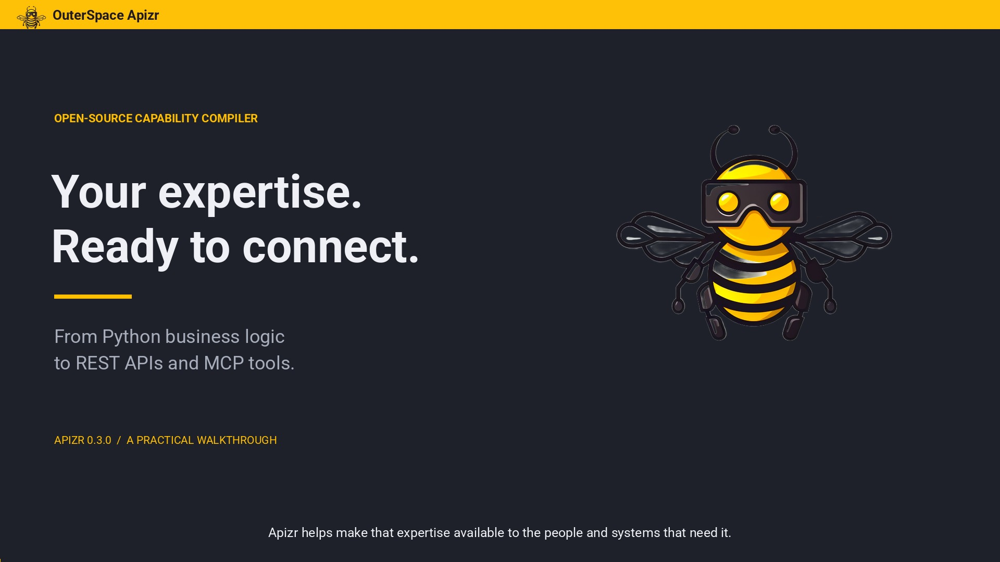

# Apizr

**An open-source capability compiler for Python codebases.**

Discover capabilities in existing Python code, assess their static readiness,
explicitly choose what to expose, generate REST or MCP interfaces, and run them
under direct or governed execution policies.

**Latest published stable: 0.3.0 · Released 22 September 2026**

**Preparing 0.4 — not released.** `master` already includes project configuration,
the Python compiler API, Git HTTPS/SSH sources, isolated plugins, OCI service
build/push and signed Attest proof publication/retrieval.
[Try the development build and complete delivery walkthrough](development/0.4.md).
The stable installation below does not include those additions.

Python 3.11–3.14 · GPL-3.0-or-later. Install with `python -m pip install outerspace-apizr==0.3.0`.
It adds explicit Exposure Plans and multi-module repository bundles. Discovery,
generation, direct servers and governed local workers need no Docker.

[Try the repository walkthrough](getting-started/introduction.md){ .md-button .md-button--primary }
[Read the 0.3 release notes](releases/0.3.0.md){ .md-button }

  <section class="apizr-demo-section md-typeset" aria-labelledby="watch-apizr-in-action">
    

      <h2 id="watch-apizr-in-action">From Python code to REST and MCP</h2>
      
Bring existing Python expertise into your applications and AI workflows. See how Apizr turns a route optimizer into callable interfaces.

      

        <a class="apizr-demo-video__cover" href="https://www.youtube.com/watch?v=u8e0fi2m80M" data-apizr-video="u8e0fi2m80M" aria-label="Play the Apizr demonstration on YouTube">
          
          ▶ Watch the demo
        </a>
      

      
English narration · English captions

      

        
Read the transcript

        

          
<strong>Put your business logic to work.</strong> For an operations team, time on the road matters. Your Python code already plans better routes. Apizr helps make that expertise available to the people and systems that need it.

          
<strong>Keep the expertise you already have.</strong> Here, a specialist has prepared a route optimizer in a notebook. The next step is to connect it to the dispatch application, using the same calculation.

          
<strong>Understand what you can expose.</strong> First, inspect the notebook with Apizr. It identifies the functions and reports which can generate an interface. Your team chooses the capability to make available.

          
<strong>Connect your operational applications.</strong> Select the route optimizer and generate REST. Apizr creates the application and its API contract. The dispatch system now has an interface it can call.

          
<strong>Generated code your team can inspect.</strong> These are the generated files. Your developers can inspect and run them. The adapter connects incoming requests to your existing function, keeping the business calculation in one place.

          
<strong>Put the generated API to work.</strong> Start the generated application and send a list of stops. The response contains a proposed route and its driving estimate. This is what the dispatch interface will use.

          
<strong>See the operational impact.</strong> Now the result becomes visible. On this eight-stop example, the estimated driving time drops from about one hundred and one minutes to forty eight.

          
<strong>Adapt when the workload changes.</strong> For a different twelve-stop tour, call the same API again. The route changes, with a fifty four percent improvement over this starting order. These estimates do not include live traffic.

          
<strong>Make the same capability available to AI.</strong> Next, use Apizr to generate an MCP server from the same function. An assistant can use the existing calculation as a tool, rather than estimate the route itself.

          
<strong>Turn a business request into an action.</strong> Ask Ollama to add the Pantheon while keeping the existing stops. Our local interface passes the generated tool definition to the model, then forwards its chosen call through MCP.

          
<strong>The same logic serves another channel.</strong> The tool returns a thirteen-stop tour. The map updates from that result. The application and the assistant now use the same underlying business logic.

          
<strong>Existing expertise. New applications.</strong> Inspect your Python. Choose what to expose. Generate REST and MCP interfaces with Apizr. Bring existing expertise into your applications and AI workflows.

        

      

    

  </section>

## Discover → Understand → Assess

`apizr scan .` inventories Python source without executing it. `apizr graph .`
explains static relationships. `apizr readiness .` evaluates evidence under policy.
Unknown evidence remains unknown; **READY does not mean exposed**.

## Select → Expose

`apizr expose plan` records your explicit capability selection. `apizr expose build`
creates one repository REST or MCP server. If selected A calls helper B, B is
packaged as support and stays private. [Plan exposure](getting-started/user-guide/exposure.md).

## Execute with an explicit boundary

| Mode | Boundary | State |
| --- | --- | --- |
| Direct | Transport process | Persists |
| Governed local | Fresh process per call | Resets |
| Governed OCI | Fresh container per call | Resets |

Local execution provides bounds and cleanup without filesystem/network isolation.
OCI adds reviewed container controls with an explicit immutable worker image; it
is not a VM or an untrusted-code guarantee. The optional
[strict OCI profile](architecture/subprocess-deny.md) prohibits process/thread creation. Source and
application dependencies must be trusted.
[Understand execution boundaries](architecture/governed-repository-runtime.md).

Single-source scripts/notebooks and the [legacy pipeline](getting-started/user-guide/apizr.md)
remain supported. [Previous 0.2.1 notes](releases/0.2.1.md) ·
[Compatibility and migration](getting-started/developer-guide/releases.md).
