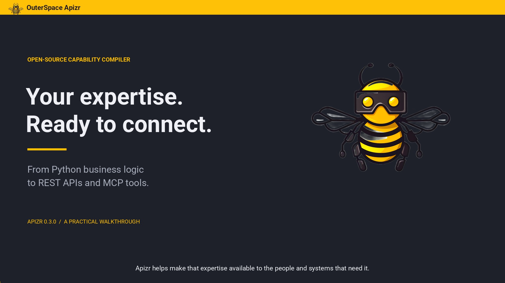

# Turn Python code into REST APIs and MCP tools

Make your Python functions available to applications and AI assistants.
Apizr reads your code, lets you choose what to share, and generates a REST API
or an MCP server. Your business logic stays in Python.

MCP (Model Context Protocol) lets AI assistants discover and use tools.

**[Apizr 0.4.4](releases/0.4.4.md) is available.** Python 3.11–3.14 · Open source,
GPL-3.0-or-later.

[Quickstart: MCP and REST calls](getting-started/quickstart.md){ .md-button .md-button--primary }
[Install Apizr](getting-started/install.md){ .md-button }

Start with two Python functions and make your first calls in the
[Quickstart](getting-started/quickstart.md). The core is enough: no plugin,
Docker or AI account is needed for its REST and Python MCP examples.

  <section class="apizr-demo-section md-typeset" aria-labelledby="watch-apizr-in-action">
    

      <h2 id="watch-apizr-in-action">From Python code to REST and MCP</h2>
      
Bring existing Python expertise into your applications and AI workflows. See how Apizr turns a route optimizer into callable interfaces.

      

        <a class="apizr-demo-video__cover" href="https://www.youtube.com/watch?v=u8e0fi2m80M" data-apizr-video="u8e0fi2m80M" aria-label="Play the Apizr demonstration on YouTube">
          
          ▶ Watch the demo
        </a>
      

      
English narration · English captions

      

        
Read the transcript

        

          
<strong>Put your business logic to work.</strong> For an operations team, time on the road matters. Your Python code already plans better routes. Apizr helps make that expertise available to the people and systems that need it.

          
<strong>Keep the expertise you already have.</strong> Here, a specialist has prepared a route optimizer in a notebook. The next step is to connect it to the dispatch application, using the same calculation.

          
<strong>Understand what you can expose.</strong> First, inspect the notebook with Apizr. It identifies the functions and reports which can generate an interface. Your team chooses the capability to make available.

          
<strong>Connect your operational applications.</strong> Select the route optimizer and generate REST. Apizr creates the application and its API contract. The dispatch system now has an interface it can call.

          
<strong>Generated code your team can inspect.</strong> These are the generated files. Your developers can inspect and run them. The adapter connects incoming requests to your existing function, keeping the business calculation in one place.

          
<strong>Put the generated API to work.</strong> Start the generated application and send a list of stops. The response contains a proposed route and its driving estimate. This is what the dispatch interface will use.

          
<strong>See the operational impact.</strong> Now the result becomes visible. On this eight-stop example, the estimated driving time drops from about one hundred and one minutes to forty eight.

          
<strong>Adapt when the workload changes.</strong> For a different twelve-stop tour, call the same API again. The route changes, with a fifty four percent improvement over this starting order. These estimates do not include live traffic.

          
<strong>Make the same capability available to AI.</strong> Next, use Apizr to generate an MCP server from the same function. An assistant can use the existing calculation as a tool, rather than estimate the route itself.

          
<strong>Turn a business request into an action.</strong> Ask Ollama to add the Pantheon while keeping the existing stops. Our local interface passes the generated tool definition to the model, then forwards its chosen call through MCP.

          
<strong>The same logic serves another channel.</strong> The tool returns a thirteen-stop tour. The map updates from that result. The application and the assistant now use the same underlying business logic.

          
<strong>Existing expertise. New applications.</strong> Inspect your Python. Choose what to expose. Generate REST and MCP interfaces with Apizr. Bring existing expertise into your applications and AI workflows.

        

      

    

  </section>

## Choose your next step

- **[Make your first calls](getting-started/quickstart.md)** — turn Python functions into REST endpoints or MCP tools.
- **[Explore a project with an AI assistant](reference/apizr-mcp-server.md)** — use Apizr's optional analysis plugin.
- **[Package a service for deployment](reference/oci-service-plugin.md)** — build a container image and publish it to your registry.

See the [installation guide](getting-started/install.md) for package availability
and optional plugins.

## Choose what becomes public

Apizr scans code without executing it and tells you which functions it can turn
into an interface. You choose which ones become public. Their private helpers
can be included without becoming endpoints or tools.

The generated **bundle** contains the server, its API or tool definitions and the
source it needs. Start with [REST endpoints](getting-started/quickstart.md#use-rest-instead)
or [MCP tools](getting-started/quickstart.md#generate-the-mcp-bundle), then use
[your own repository](getting-started/onboarding.md).

## Decide how calls execute

The Quickstart runs trusted functions inside the generated server. For fresh
workers, timeouts or container execution, continue with
[execution policies](getting-started/user-guide/execute.md). Running a generated
server executes your Python code; static analysis does not make unfamiliar code
safe to run.

## Explore the MCP ecosystem

Find Apizr's analysis plugin on
[Glama](https://glama.ai/mcp/servers/Alien6-Studio/outerspace-apizr) and the
[official MCP Registry](https://registry.modelcontextprotocol.io/?q=io.github.Alien6-Studio%2Fouterspace-apizr).
It helps an assistant explore your project. To let an assistant call your own
functions, follow the [MCP guide](getting-started/user-guide/mcp.md).

Watch the tutorials throughout these guides or visit
[Alien6 Studio on YouTube](https://www.youtube.com/@Alien6Studio).

Want to improve Apizr? The [contributor guide](about/CONTRIBUTING.md) covers
development setup, tests and pull requests.
